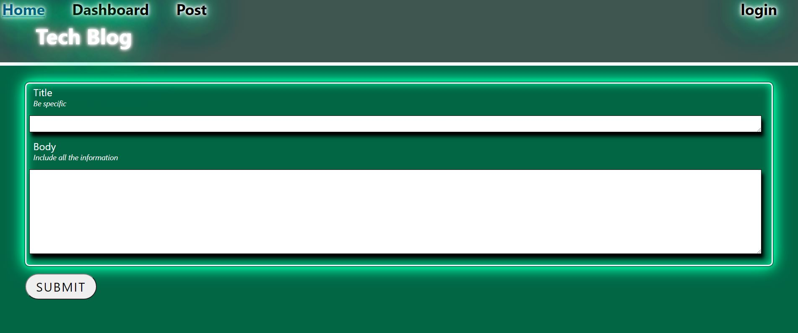

# Model-View-Controller (MVC): Tech Blog


### Table of contents

- [Links](##Links)
- [Aim](##Aim)
- [Prerequisites](##Prerequisites)
- [Collaborators](##collaborators)
- [Install Guide](##Install)
- [Pictures](##Pictures)

## Links

- [GitHub Repository](https://github.com/jpd61/e-commerce-backend)

<!-- - [Deployed on heroku](https://shielded-escarpment-72538.herokuapp.com/) -->

## Aim

Writing about tech can be just as important as making it. Developers spend plenty of time creating new applications and debugging existing codebases, but most developers also spend at least some of their time reading and writing about technical concepts, recent advancements, and new technologies. A simple Google search for any concept covered in this course returns thousands of think pieces and tutorials from developers of all skill levels!

## Prerequisites

- Javascript
- React
- Express
- Node.js
- NPM
- MySql
- My Sql Workbench
- Handlebars

## Collaborators

If you would like to colaborate on this project or would like to know more please see my contacts for information oh how to reach me.

## Install

<span style="color:green">Clone Repository</span> - (From github Repository)

<span style="color:green">NPM i</span> - (To install all required packages from package.json)

<span style="color:green">Create file .env </span> - (From github Repository)

```.env
DB_USER=''
DB_PW=''
DB_NAME='tech_blog_db'

```

<span style="color:green">Create Db</span> - ( Sql database)

```
DROP DATABASE IF EXISTS tech_blog_db;
CREATE DATABASE tech_blog_db;
```

<span style="color:green">Node Server.js</span> - (Starts program)

<span style="color:green">Visist http://localhost:3001/</span> - (Or change PORT)

<span style="color:green">Use postman/insomnia to test routes</span> - (Useage)

---

## Pictures



